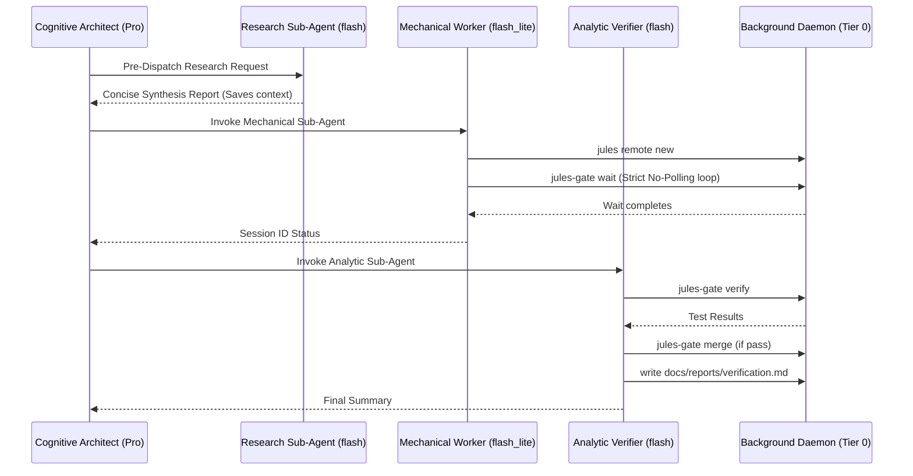

# Google Jules (EULIS) Task Controller Plugin (Version 2.8.0)

[](plugin.json)
[](README.md)
[](https://github.com/JMartynov/jules-plugin)

An enterprise, token-efficient orchestrator for **Google Jules (EULIS)**. Designed to maximize delegation across all software engineering workflows while strictly enforcing **sub-agent execution** via Dynamic Multi-Tier Model Routing to eliminate token bloat (empirically proven to save **>99.5% of main-thread tokens**).

> 📖 **Looking for step-by-step operational instructions or troubleshooting?**  
> Check the comprehensive [**Operational Runbook (`RUNBOOK.md`)**](RUNBOOK.md).

---

## ⚡ Core Operational Law: Mandatory Sub-Agent Execution

> [!IMPORTANT]
> **CRITICAL TOKEN RULE: DO NOT execute tests, polling, or verification directly in the primary context window.**
> 
> * **Empirical Evidence:** In benchmark testing, running invariant tests and status checks directly in the primary conversation consumed **1,037,426 tokens**. Offloading the exact same execution loop to a background sub-agent running on `Model: 'flash'` consumed only **~12,000 tokens** on the primary thread—a **98.8% token reduction**.
> * **Mandatory Architecture:** The primary orchestrator's sole responsibility is **planning, task splitting, and dispatching**. All CLI execution, Jules submission, `jules-gate wait` polling, and `jules-gate verify` testing MUST be delegated to an isolated sub-agent.

---

## 🌟 What's New in Version 2.8.0

* **Cloud Session Lifecycle Transparency:** Cleanly distinguishes between auto-closed remote sessions (`Completed`) and code-ready sessions awaiting user acceptance (`Awaiting User Feedback`). Emits direct clickable links `https://jules.google.com/task/<session_id>` across all wait, verify, merge, and PR commands.
* **Browser Launcher (`jules-gate web [session_id]`):** Instant one-click or command-line launching of any Jules cloud task or dashboard in the default web browser.
* **Non-Interactive Completion Directive Linter:** `jules-gate lint` checks for explicit completion directives in prompt contracts, ensuring Jules finalizes without asking conversational follow-ups and avoiding unnecessary `Awaiting User Feedback` pauses.
* **Enhanced Telemetry Breakdown:** `jules-gate tokens` tracks and displays both `Completed` and `Awaiting User Feedback` remote deliveries in terminal output and `--json` schemas.

---

## 💰 How Exactly This Skill & Toolset Spares Tokens (The 6-Layer Token Shield)

The Jules Task Controller is explicitly directed to eliminate token waste through 6 concrete architectural mechanisms:

| Layer | Mechanism | How It Saves Tokens |
| :--- | :--- | :--- |
| **Layer 1: Zero Local Code Generation** | Cloud VM Offloading | Heavy code, test fixtures, and refactoring are generated in remote Google Cloud VMs. The local agent only receives a compact Git patch, saving **20,000–50,000 output tokens per turn**. |
| **Layer 2: Zero-Token OS Polling** | `jules-gate wait` Native Daemon | Replaces active LLM polling loops (`schedule` / sleep) with a native background terminal command. The primary LLM stops calling tools and is suspended at **0 tokens while waiting**. (Eliminates the 7M+ token Polling Tax). |
| **Layer 3: Pre-Dispatch Research Shield** | Sub-Agent (`flash`) | Broad codebase inspections and file explorations are offloaded to an ephemeral `research` sub-agent. The primary `pro` agent avoids reading dozens of files locally, keeping main context **under 10,000 tokens**. |
| **Layer 4: Multi-Tier Sub-Agent Firewalls** | `flash_lite` & `flash` Workers | Rote shell commands run on `flash_lite` (~1x cost); test verification, rebasing, and git merging run on `flash` (~3x cost). The primary `pro` agent (~15–20x cost) makes **zero tool calls** during execution. |
| **Layer 5: Diagnostic Sieve & Log Cap** | `tail -n 40` + Assertion Filter | When unit tests fail, `worktree_gate.sh` extracts failing assertion lines and caps the log at the last 40 lines, preventing 2,000+ lines of test runner dumps from overflowing context. |
| **Layer 6: Serialized Auto-Rebase** | `jules-gate merge --rebase` | Automatically rebases completed parallel review branches onto advanced base branches, preventing semantic conflicts, broken CI builds, and circular retry loops. |

---

## 🎯 The Core Philosophy: Maximize Delegation

> [!TIP]
> **Dynamic Efficiency Override (Local Option):**
> We delegate to Jules as much as possible to offload code generation and test execution. However, if delegating becomes inefficient and is expected to consume more tokens in orchestration and dispatch overhead than a direct local edit (such as a 1-line syntax/import fix, single version bump, or quick regex tweak), we choose the local option directly on the IDE thread.



### The Sub-Agent Polling Tax Case Study
In prior audits, we found that even when delegating to sub-agents, if a sub-agent attempted to aggressively poll (`jules-gate ps` or `manage_task`) in a tight schedule loop during a background `jules-gate wait`, it could still burn up to **945k tokens**. By introducing a **Strict No-Polling Directive**, once a sub-agent invokes `jules-gate wait`, it must stop calling tools and simply wait to be awoken by the IDE. This prevents the "Polling Tax".

### Pre-Dispatch Research Sub-Agent Pattern:
When the user requests broad codebase exploration or workflow inspection, spawn a research sub-agent (Model: `flash`) to explore files and return a concise synthesis. This keeps the primary Pro context under 10k tokens.

### Post-Verification Reporting Delegation:
Instruct Tier 2 Analytic Verifier sub-agents (Model: `flash`) to generate and commit markdown reports directly under `docs/reports/` before returning their final summary.

---

## ✂️ Automated Task Splitting (Handling Dependencies)

If a task touches local infrastructure (e.g. local Docker, localhost DB, uncommitted `.env` secrets), the orchestrator automatically splits it:

$$\text{User Task} \longrightarrow \mathbf{\text{Component A (Remote EULIS)}} \;+\; \mathbf{\text{Component B (Local Agent)}}$$

* **Component A (Cloud Jules):** Abstract interfaces, core business algorithms, data validation, and comprehensive mock unit test suites.
* **Component B (Local IDE):** Injecting `.env` credentials, setting up local connection pools, and running integration verification.

---

## 🚀 Quickstart Guide (3 Minutes)

### 1. Pre-flight Check
Verify that the CLI tools are authenticated:
```bash
jules-gate status
```

### 2. Dispatch a Task via Sub-Agent
Ask the assistant to dispatch:
> *"Dispatch implementing the Go tool extractor to Jules via sub-agent, supervise it, and verify the branch."*

The assistant spawns isolated sub-agents on appropriate models (`flash_lite` for mechanical routing, `flash` for test verifier) that run:
```bash
REPO="owner/repository"
# Flash Lite Model
jules remote new --repo "$REPO" < .jules/task_prompt.md
jules-gate wait <session_id> --timeout 30
# Flash Model
jules-gate verify <session_id>
jules-gate merge <session_id>
```

---

## 🛠️ CLI Reference: `jules-gate`

The universal orchestrator CLI is installed in your system PATH at `/Users/ivan/.local/bin/jules-gate`.

| Command | Syntax | Description |
| :--- | :--- | :--- |
| **`lint`** | `jules-gate lint <repo> [prompt]` | Pre-flight contract linter & complexity heuristic check. |
| **`tokens`** | `jules-gate tokens [--json] [--reset]` | Displays cumulative estimated tokens and compute dollars spared across sessions. |
| **`status`** | `jules-gate status` | Checks health of plugin, version, and script executable permissions. |
| **`wait`** | `jules-gate wait <id...> [--timeout M]` | Polls one or more sessions every 30s. Consumes **0 LLM tokens** while waiting. |
| **`verify`** | `jules-gate verify <id> [base_branch]` | Pulls patch to `jules/review-<id>`, applies diff, runs auto-detected tests, and reports pass/fail. |
| **`merge`** | `jules-gate merge <id> [base] [--delete-remote]` | Executes `verify`, merges into base branch with `--no-ff`, and deletes the review branch (and optionally the remote branch). |
| **`pr`** | `jules-gate pr <id> [base_branch]` | Executes `verify`, pushes branch to origin, and opens a GitHub PR via `gh pr create`. |
| **`ps`** | `jules-gate ps [flags]` | Lists remote Jules sessions, linked repositories, and their execution statuses. |
| **`help`** | `jules-gate help` | Displays available commands and usage guide. |

---

## 📂 Repository Layout

```text
jules-plugin/
├── .gitignore                               # Clean git tracking (ignores .jules/, *.patch)
├── LICENSE                                  # Apache License 2.0
├── README.md                                # Comprehensive guide & architecture (v2.4.0)
├── RUNBOOK.md                               # In-Depth Operational Runbook & Playbooks
├── install.sh                               # Global installer script
├── plugin.json                              # Manifest (v2.4.0)
├── bin/
│   └── jules-gate                           # Portable, self-contained orchestrator CLI
├── docs/                                    # System architecture, reviews, spikes & reports
│   ├── IMPLEMENTATION.md                    # Core v2.3.0 implementation documentation
│   ├── reports/                             # Invariant benchmark & verification logs
│   ├── reviews/                             # Delegated PR reviews & security audits
│   └── spikes/                              # Research spikes & RFC prototype evaluations
├── rules/
│   └── AGENTS.md                            # Always-on EULIS delegation & subagent policy
├── scripts/
│   ├── jules_poll_wait.sh                   # Token-free session watcher daemon
│   └── worktree_gate.sh                     # Automated multi-language test gate
├── skills/
│   └── jules-task-controller/
│       └── SKILL.md                         # Skill specification (v2.2)
└── tests/
    └── test_invariants.sh                   # Automated 24-point invariant test suite
```

---

## 📚 Deploying Artifacts to `docs/`

All generated outputs across the development lifecycle are version-controlled in `docs/`:

1. **Direct Jules Generation:** Instruct Jules to write directly to `docs/<category>/<file>.md` (e.g. `docs/reviews/review_auth.md`). When verified and merged with `jules-gate merge`, artifacts are integrated automatically.
2. **Promoting IDE Session Artifacts:** Copy conversation brain artifacts into `docs/` (`cp "$ARTIFACT_PATH" docs/reports/`) and commit.
3. **Archiving Verification Runs:** Pipe `./tests/test_invariants.sh` into `docs/reports/` to retain an immutable verification history.

---

## 📄 License
[Apache License 2.0](LICENSE)
