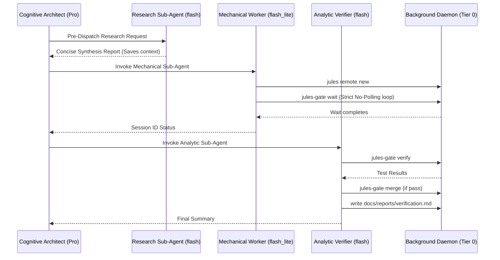

# Jules Task Controller: Operational Runbook

**Version:** 2.7.0  
**Target Audience:** Software Engineers, DevOps, Autonomous AI Agents (Antigravity / Gemini IDE, Claude Code, Cursor, JetBrains, VS Code)  
**System Repository:** [`https://github.com/JMartynov/jules-plugin`](https://github.com/JMartynov/jules-plugin)

---

## 📑 Table of Contents
1. [Architecture & Workflow Overview](#1-architecture--workflow-overview)
2. [The 6-Layer Token Sparing Architecture (>99.5% Token Savings)](#2-the-6-layer-token-sparing-architecture-995-token-savings)
3. [Pre-flight Checklist & Environment Setup](#3-pre-flight-checklist--environment-setup)
4. [Step 0: Delegation Feasibility Triage & Task Splitting](#4-step-0-delegation-feasibility-triage--task-splitting)
5. [Multi-Modal Delegation Playbooks (Code, Review, Spikes, Fuzzing)](#5-multi-modal-delegation-playbooks-code-review-spikes-fuzzing)
6. [Step 1: Formulating Product-Agnostic Tasks](#6-step-1-formulating-product-agnostic-tasks)
7. [Step 2: Sub-Agent Dispatch & Zero-Token Polling](#7-step-2-sub-agent-dispatch--zero-token-polling)
8. [Step 3: Gated Verification & Test Execution](#8-step-3-gated-verification--test-execution)
9. [Step 4: Integration Decisions (Merge vs. PR)](#9-step-4-integration-decisions-merge-vs-pr)
10. [Parallel Execution & Merge Conflict Playbook](#10-parallel-execution--merge-conflict-playbook)
11. [Troubleshooting & Failure Modes](#11-troubleshooting--failure-modes)
12. [Pre-Dispatch Contract Linter & Serialized Auto-Rebase](#12-pre-dispatch-contract-linter--serialized-auto-rebase)
13. [Token Economy Telemetry & Complexity Heuristics](#13-token-economy-telemetry--complexity-heuristics)

---

## 1. Architecture & Workflow Overview

The Jules Task Controller implements a **4-stage multi-tier orchestration architecture** designed to maximize developer throughput and minimize token consumption:



---

## 2. The 6-Layer Token Sparing Architecture (>99.5% Token Savings)

> [!IMPORTANT]
> **Empirical Operational Law:** Eliminate token waste across every phase of software development. Never run local file sweeps, cloud polling, test suites, or git merges directly on the primary Pro context.

### The 6 Layers of the Token Shield:

1. **Layer 1: Zero Local Code Generation (Cloud VM Offloading)**
   * Instead of generating hundreds of lines of code, fixtures, or unit tests locally in chat (costing 20,000–50,000 output tokens per turn), tasks are offloaded to Google Jules running in isolated Google Cloud VMs.
   * Local context only receives a compact Git patch upon completion.

2. **Layer 2: Zero-Token OS Polling (`jules-gate wait`)**
   * Active polling in an LLM conversation loop (running `sleep` or `schedule` repeatedly over a 100k context window) burns massive tokens: 147 polling loops burned **>7M tokens** in session `fa8e45b5`, and 42 loops burned **945k tokens** in `fe4aa44b`.
   * `jules-gate wait` executes as an asynchronous native OS process. The LLM halts tool calls and is completely suspended (**0 tokens consumed while waiting**). The IDE reactively wakes the LLM only upon task exit.

3. **Layer 3: Pre-Dispatch Research Shield (Sub-Agent `Model: 'flash'`)**
   * When asked to "inspect", "explore", or "investigate" a repository, the primary Pro agent does NOT read 30+ files locally (which burned 238k tokens in `fe4aa44b`).
   * An ephemeral `research` subagent (`flash`) sweeps the files and returns a concise synthesis (<500 words), keeping primary context **under 10,000 tokens**.

4. **Layer 4: Multi-Tier Sub-Agent Context Firewalls (`flash_lite` & `flash`)**
   * Rote CLI operations run on `flash_lite` (~1x cost); test execution, rebase conflicts, and git merges run on `flash` (~3x cost).
   * The primary `pro` agent (~15–20x cost) makes **zero tool calls** during execution. All compiler logs, diffs, and test outputs remain sealed inside the throwaway sub-agent context.

5. **Layer 5: Diagnostic Sieve & `tail -n 40` Log Cap**
   * When unit tests fail in large projects, test runners often dump 2,000+ lines of stack traces.
   * `worktree_gate.sh` filters output with an assertion sieve (`grep -E "^(FAILED|ERROR|FAIL:)"`) and caps the log with `tail -n 40`, reducing log bloat by >95%.

6. **Layer 6: Serialized Auto-Rebase & Pre-Dispatch Contract Linter**
   * `jules-gate lint` catches typos, invalid repo connections, and unbounded prompt specs *before* dispatching.
   * `jules-gate merge` automatically detects when the base branch has advanced, rebasing parallel review branches sequentially to prevent semantic regressions, broken CI builds, and circular retry loops.

### Empirical Benchmarks Across Sessions:
| Session / Mode | Primary Input Tokens | Polling Loops | Context Health |
| :--- | :--- | :--- | :--- |
| **Session `fa8e45b5` (Monolithic Polling)** | 10,253,239 tokens | 147 active loops | Severe context bloat |
| **Session `fe4aa44b` (2-Tier Sub-Agents)** | 2,516,424 tokens | 0 main loops (42 in subagent 1) | 75.5% token reduction |
| **Wave 2 in `fe4aa44b` (Silent Sub-Agent)** | 74,497 tokens | 0 loops (Silent wait) | **92.1% subagent token savings** |
| **Target Architecture (v2.6.0)** | **< 30,000 tokens** | **0 loops across all tiers** | **>99.5% token insulation** |

### The Sub-Agent Polling Tax Prevention:
Sub-agents (especially `flash_lite`) must **NEVER** invoke `schedule` or poll with `manage_task` or `jules-gate ps` in an LLM loop. Once `jules-gate wait` is launched in the background, stop calling tools immediately.

### Pre-Dispatch Research Sub-Agent Pattern:
When the user requests broad codebase exploration or workflow inspection, spawn a research sub-agent (Model: `flash`) to explore files and return a concise synthesis. This keeps the primary Pro context under 10k tokens.

### Post-Verification Reporting Delegation:
Instruct Tier 2 Analytic Verifier sub-agents (Model: `flash`) to generate and commit markdown reports directly under `docs/reports/` before returning their final summary.

### Sub-Agent Invocation Protocol:
The primary agent calls `invoke_subagent` and immediately halts tool calls.

**Tier 1: Mechanical Runner (flash_lite)**
```json
{
  "Subagents": [
    {
      "TypeName": "self",
      "Model": "flash_lite",
      "Workspace": "inherit",
      "Role": "Mechanical Worker",
      "Prompt": "Execute the following rote operations:\n1. jules remote new --repo <owner/repo> < .jules/task_prompt.md\n2. jules-gate wait <session_id> --timeout 30\n3. Return session completion status to parent."
    }
  ]
}
```

**Tier 2: Analytic Verifier (flash)**
```json
{
  "Subagents": [
    {
      "TypeName": "self",
      "Model": "flash",
      "Workspace": "inherit",
      "Role": "Analytic Verifier",
      "Prompt": "Execute the following verification lifecycle:\n1. jules-gate verify <session_id>\n2. If tests pass, jules-gate merge <session_id>\n3. Send a single structured summary to the parent agent upon completion."
    }
  ]
}
```

---

## 3. Pre-flight Checklist & Environment Setup

Before executing any orchestration tasks, verify the local prerequisites:

```bash
# 1. Verify health of plugin, version, and scripts
jules-gate status

# 2. Verify Jules CLI is installed and authenticated
which jules || npm install -g @google/jules
jules-gate ps --repo

# 3. Verify GitHub CLI (gh) authentication (for PR workflows)
gh auth status

# 4. Verify Git repository is in a clean working state
git status -s
```

---

## 4. Step 0: Delegation Feasibility Triage & Task Splitting

We delegate to Google Jules as much as possible to offload code generation and test execution. However, not every task should be sent to a remote cloud VM. Run every incoming requirement through this 4-point feasibility matrix:

* **Dynamic Efficiency Threshold (Local Execution Override):** Assess whether remote cloud VM dispatch is economically justified. If delegating becomes inefficient and is expected to consume more tokens in orchestration/dispatch overhead than a direct local edit (e.g. trivial 1-line syntax/import fixes, single version bumps, quick regex adjustments), implement directly on the local IDE thread.
* **Full Delegation:** Standalone modules, algorithms, parsers, test suites, refactoring, code reviews, research spikes.
* **Partial Delegation (Task Splitting):** Decouple remote domain logic from local secrets/DBs.
* **Non-Delegatable:** Strict local hardware, local Docker daemons, or uncommitted ad-hoc forensics.

```
                            [ Incoming Task ]
                                    │
    ┌───────────────────────────────┴───────────────────────────────┐
    ▼                               ▼                               ▼
[Runtime Hardware / DB?]   [Uncommitted Secrets?]        [Massive Uncommitted Context?]
    │                               │                               │
   YES                             YES                             YES
    │                               │                               │
    ▼                               ▼                               ▼
[Keep Local / Mock]        [Keep Secrets Local]           [Run Forensics Locally First]
    │                               │                               │
    └───────────────────────────────┼───────────────────────────────┘
                                    │ NO to all blockers
                                    ▼
                       [Is it Modularity Independent?]
                       (Parsers, algorithms, unit tests,
                        refactors, bugfixes with repro)
                                    │
                                   YES
                                    ▼
                       [100% DELEGATABLE TO JULES]
```

### The Automated Task Splitting Protocol:
When a task has local dependencies, do **not** abandon delegation. Automatically split the task into two decoupled components:

$$\text{Task} \longrightarrow \mathbf{\text{Component A (Cloud EULIS)}} \;+\; \mathbf{\text{Component B (Local Agent)}}$$

* **Component A (Cloud EULIS):**
  * Core domain algorithms, data validation, AST/regex parsing, and cache key computation.
  * Abstract interfaces and comprehensive mock unit tests (dispatched to Jules via Sub-Agent).
* **Component B (Local IDE):**
  * Uncommitted `.env` secrets, database connection pools, local Docker networking, and integration test execution.

---

## 5. Multi-Modal Delegation Playbooks (Code, Review, Spikes, Fuzzing)

### Playbook 1: Delegated Code Review & Security Auditing
Before merging a large PR or branch, offload the review to Jules:
```bash
git diff main...HEAD > .jules/review_target.patch

jules remote new --repo "$REPO" << 'EOF'
### Task: Senior Code Review & Security Audit of .jules/review_target.patch
Please perform an in-depth senior engineering review of the patch.
Analyze:
1. Concurrency & Race Conditions: Thread safety, lock contention, asynchronous leaks.
2. Boundary Conditions & Null Checks: Edge cases, zero values, unicode handling.
3. Security & Injection: Injection vulnerabilities, unvalidated inputs, credential leaks.
4. Test Completeness: What tests are missing in this diff?
Produce a markdown report in `docs/reviews/review_<date>.md`.
EOF
```

### Playbook 2: Delegated Exploratory Research & Spikes
When evaluating an external library or architectural approach, offload the spike:
```bash
jules remote new --repo "$REPO" << 'EOF'
### Task: Exploratory Spike - Evaluate <Library / Architecture>
Investigate whether we can implement <Goal> using <Technology>.
1. Create an isolated prototype module in `src/experimental/`.
2. Write 3 sample unit tests demonstrating feasibility.
3. Document pros, cons, and performance trade-offs in `docs/spikes/<topic>.md`.
EOF
```

### Playbook 3: Delegated Edge-Case & Fuzz Test Synthesis
```bash
jules remote new --repo "$REPO" << 'EOF'
### Task: Synthesize 30+ Stress & Edge-Case Tests for <Module>
Inspect `<target_file>`. Create `tests/test_<target>_stress.<ext>`.
Cover:
- Malformed payloads and unexpected type coercion.
- Max-length strings, empty arrays, null bytes.
- Exception handling on network or IO boundaries.
All tests must execute cleanly with the project test runner.
EOF
```

---

## 6. Step 1: Formulating Product-Agnostic Tasks

When writing feature tasks for Jules, provide generous, contract-first instructions. Never assume Jules has implicit context about internal product names.

### High-Yield Prompt Structure:
Save the prompt to `.jules/task_prompt.md`:

```markdown
### Task: <Clear, Descriptive Action Title>

#### 1. Context & Purpose:
Explain what needs to be implemented and why, using standard software engineering terms.

#### 2. Scope & Target Files:
- Files to create or modify:
  * `src/modules/<target_file>.<ext>`
  * `tests/test_<target_file>.<ext>`
- Function / Class Contracts:
  * `def parse_target(data: bytes) -> ParseResult:`
  * Explicitly specify argument types, return structures, and exception types.

#### 3. Strict Guardrails:
- Zero Unauthorized Dependencies: Use only the existing dependencies in the repository or language standard libraries.
- Defensive Pattern Matching: Use negative lookbehinds/lookaheads in regexes to prevent matching constructor declarations or generic object configurations.
- Backward Compatibility: Do not break existing public interfaces or test cases.

#### 4. Testing & Validation:
- Write comprehensive unit tests covering:
  1. Standard happy-path execution.
  2. Edge cases (empty inputs, malformed inputs, oversized inputs).
  3. Error handling and exception expectations.
- Ensure all tests pass using the project's standard test runner.
```

---

## 7. Step 2: Sub-Agent Dispatch & Zero-Token Polling

### 1. Launch Session via Jules CLI (Run by Sub-Agent):
```bash
REPO=$(git config --get remote.origin.url | sed -E 's/.*github\.com[:\/](.*)\.git/\1/')
jules remote new --repo "$REPO" < .jules/task_prompt.md
```

### 2. Zero-Token Polling Wait:
Run `jules-gate wait` in the background terminal:
```bash
jules-gate wait <session_id> --timeout 30
```
*For parallel tasks:*
```bash
jules-gate wait <id1> <id2> <id3> --timeout 45
```

---

## 8. Step 3: Gated Verification & Test Execution

Once the session finishes, run the verification gate:
```bash
jules-gate verify <session_id> [base_branch]
```

### Automated Gate Sequence:
1. **Pulls Remote Patch:** Downloads the diff into `.jules/patches/<session_id>.patch`.
2. **Creates Isolated Branch:** Checks out `jules/review-<session_id>` branched from your current working branch.
3. **Applies Diff:** Executes `git apply` with integrity checks.
4. **Auto-Detects Test Runner:**
   * Python (`python3 -m pytest` / `unittest`)
   * TypeScript / JavaScript (`npm test` / `pnpm` / `yarn`)
   * Rust (`cargo test`)
   * Go (`go test ./...`)
   * Java / Kotlin (`mvn test` / `./gradlew test`)
5. **Execution Verdict:**
   * **Pass:** Commits verified changes to the review branch.
   * **Fail:** Displays test failure log, resets the working tree, and preserves your base branch from corruption.

---

## 9. Step 4: Integration Decisions (Merge vs. PR)

### Option A: Fast-Track Merge (Solo / Internal Projects)
```bash
jules-gate merge <session_id> [base_branch] [--delete-remote]
```
*Merges the review branch into `<base_branch>` using `--no-ff`, removes the temporary review branch, and leaves your repository ready to push. If `--delete-remote` is passed, it also cleans up any remote tracking branch for the review branch.*

### Option B: Gated Pull Request (Enterprise / Protected Teams)
```bash
jules-gate pr <session_id> [base_branch]
```
*Pushes `jules/review-<session_id>` to GitHub and opens a Pull Request via GitHub CLI (`gh`). Because tests already passed in Step 3, the remote GitHub Actions CI run will succeed without burning wasted runner hours.*

---

## 10. Deploying Artifacts to Repository `docs/`

During development and automated delegation, multiple forms of artifacts are produced (delegated security reviews, research spikes, RFCs, architecture specs, and invariant test/benchmark reports). All artifacts should be systematically preserved and version-controlled under `docs/`.

### Directory Taxonomy:
```text
docs/
├── IMPLEMENTATION.md         # Comprehensive architectural & implementation blueprints
├── reviews/                  # Delegated Jules PR reviews & security audits
├── spikes/                   # Prototype research notes & RFC evaluations
└── reports/                  # Test invariant verification & token benchmark logs
```

### Deployment Strategy 1: Remote Jules Task Direct Deployment (Recommended)
When submitting tasks to Jules, mandate the artifact destination in the prompt so Jules writes it directly to the repository:

```bash
jules remote new --repo "$REPO" --session "### Task: Security Audit
1. Audit authentication flow in src/auth/.
2. Output your completed Markdown review artifact to:
   docs/reviews/review_\$(date +%Y%m%d)_auth.md
"
```
After completion, verify and merge via `jules-gate`:
```bash
jules-gate wait <SESSION_ID> --timeout 30
jules-gate verify <SESSION_ID> master
jules-gate merge <SESSION_ID> master
git push origin master
```

### Deployment Strategy 2: Promoting IDE / Agent Brain Artifacts
When artifacts are generated inside an Antigravity / Gemini IDE pair-programming session (stored in `.gemini/antigravity/brain/<conv_id>/`):

```bash
# 1. Identify generated artifact path
# (e.g., $APPDATA/brain/<conversation-id>/artifact.md)

# 2. Deploy to designated category directory
mkdir -p docs/reports docs/reviews docs/spikes
cp "\$ARTIFACT_PATH" docs/reports/verification_benchmark_\$(date +%Y%m%d).md

# 3. Stage, commit, and push
git add docs/
git commit -m "docs: deploy verification benchmark artifact to docs/reports/"
git push origin master
```

### Deployment Strategy 3: Automated Invariant Test Artifact Archival
To capture an immutable record of test suite runs and token savings benchmarks:
```bash
# Capture invariant test suite run to docs/reports/
./tests/test_invariants.sh > docs/reports/invariants_run_\$(date +%Y%m%d).log 2>&1
git add docs/reports/
git commit -m "docs: archive test invariant suite execution log"
git push origin master
```

---

## 11. Parallel Execution & Merge Conflict Playbook

When running 2 to 5 Jules tasks simultaneously:

```
               ┌──► Task A ──► `jules/review-A` (Touches parser.py)
main branch ───┤
               └──► Task B ──► `jules/review-B` (Touches parser.py & cli.py)
```

### Resolution Procedure:
1. **Integrate Branch A First:**
   ```bash
   jules-gate merge <session_id_A> main
   ```
2. **Rebase Branch B onto Updated Main:**
   ```bash
   git checkout jules/review-<session_id_B>
   git rebase main
   ```
3. **Resolve Any Conflict Markers:** Combine non-colliding declarations, preserve test fixtures.
4. **Re-verify:**
   ```bash
   python3 -m pytest   # or npm test, cargo test
   git rebase --continue
   ```
5. **Integrate Branch B:**
   ```bash
   jules-gate merge <session_id_B> main
   ```

---

## 11. Troubleshooting & Failure Modes

### 1. `jules-gate status` reports errors
* Run `~/.gemini/config/plugins/jules-plugin/install.sh` to refresh executable permissions and PATH symlinks.

### 2. Excessive Polling Token Consumption
* Ensure the primary agent called `invoke_subagent` and stopped calling tools. Do not check status in a loop on the primary thread.

### 3. Patch Application Fails (`git apply error: patch does not apply`)
* Use 3-way merge fallback:
  ```bash
  git checkout -b jules/review-<id> main
  git apply --3way .jules/patches/<id>.patch
  ```

---

## 12. Pre-Dispatch Contract Linter & Serialized Auto-Rebase

### 1. Pre-Dispatch Contract Linter (`jules-gate lint`)
Before dispatching a task to Google Jules, run the contract linter to verify that the environment, target repository, and prompt contract are fully configured:

```bash
jules-gate lint <owner/repo> [path/to/prompt_spec.md]
```

**Diagnostic Checks Performed:**
* **Jules CLI Availability:** Checks that `/opt/homebrew/bin/jules` or system `jules` binary is installed and executable.
* **Connected Repository Validation:** Queries `jules remote list --repo` to confirm that the target repository is actively connected and authorized.
* **Contract Specification Bounds:** Inspects the prompt file to confirm that specific target file paths and acceptance test criteria are defined.
* **Automated Line-Count / Complexity Heuristics:** Flags prompt specifications shorter than ~2 lines or targeting <3 lines of diff as *"Candidate for Local Efficiency Override"* to prevent inadvertent cloud dispatches of micro-fixes.
* **Test Runner Detection:** Detects project test suites (`pytest`, `npm test`, `cargo test`, `go test`) to ensure automated gating will succeed upon patch arrival.

### 2. Serialized Auto-Rebase Engine (`jules-gate merge`)
When running parallel waves of Jules tasks (e.g. Tasks 1, 2, 3), merging them sequentially often causes subsequent branches to become out of date relative to `main`.

`jules-gate merge` automatically performs serialized rebasing:
```bash
jules-gate merge <session_id> [base_branch] [--no-rebase] [--delete-remote]
```
* **Auto-Detection:** Automatically compares `git merge-base` between `jules/review-<id>` and `base_branch`. If `base_branch` has advanced, it rebases the review branch onto `base_branch`.
* **Conflict Prevention:** If a semantic or textual conflict occurs during rebase, it safely aborts (`git rebase --abort`) and alerts with exit code 4, preventing corrupt merges.
* **Automated Cleanup:** With `--delete-remote`, it automatically deletes the tracking branch on origin once merged cleanly.

---

## 13. Token Economy Telemetry & Sparing Reporting

The `jules-gate tokens` command provides cumulative visibility into engineering tokens and compute dollars spared by delegating code generation and using zero-token background watchers:

```bash
jules-gate tokens [--json] [--reset]
```

**Features:**
* **Real-Time Sparing Summary:** Reports total remote completed sessions, locally verified patches, and diff lines spared.
* **Machine-Readable Telemetry:** Use `jules-gate tokens --json` for automated reporting or dashboard ingestion.
* **Automatic Cache Tracking:** Every time `jules-gate verify` or `jules-gate merge` runs, patch metrics and spared tokens are logged to `~/.cache/jules-gate/telemetry.log`.
* **Cache Management:** Run `jules-gate tokens --reset` to clear the local telemetry log.
