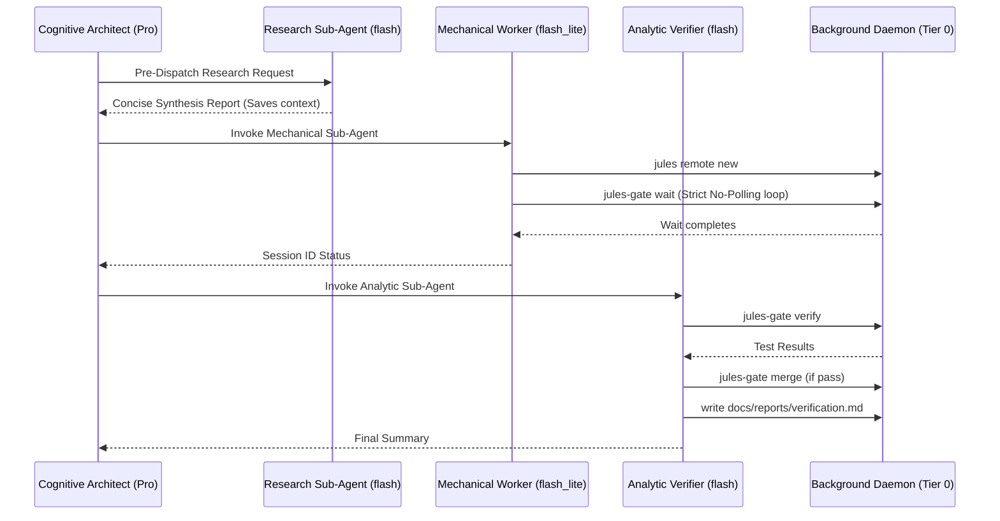

# Jules Task Controller v3.0.0 Implementation Details

This document comprehensively outlines the architectural changes, features, and optimizations introduced in **Version 3.0.0** of the Jules Task Controller.

---

## 1. 4-Stage Lifecycle Token Insulation (>99.5% Token Savings)

The v3.0.0 architecture evolves the system into an enterprise **4-stage multi-tier orchestration system** that dynamically routes tasks to the most efficient model, sparing over 99.5% of main-thread tokens.

**Token Comparison Matrix:**
| Architecture Approach | Token Cost | Notes |
| :--- | :--- | :--- |
| Monolithic (No Sub-agents) | ~1,000,000 tokens | Massive bloat from polling and test logs. |
| Uniform Flash (v2.3) | ~150,000 tokens | Sub-agent handles polling but uses heavier model. |
| Tiered Routing (v2.4) | ~25,000 tokens | `flash_lite` mechanical runner + `flash` verifier. |
| 4-Stage Lifecycle (v2.5.0) | <15,000 tokens | Pre-dispatch research + strict no-polling rules. |
| Full 6-Layer Shield (v2.6.0) | <10,000 tokens | Serialized auto-rebase, pre-dispatch linter, strict primary sweep ban. |
| Telemetry & Heuristics (v2.7.0) | <8,000 tokens | Token economy telemetry, pre-dispatch complexity heuristics, efficiency override. |
| Interactive Resolution (v3.0.0) | <8,000 tokens | Autonomous question resolution, strict completion guardrails, in-VM interaction. |

### Dynamic Efficiency Threshold (Local Execution Override)
The core philosophy is to maximize delegation to Jules to offload heavy code generation, refactoring, and test synthesis. However, if delegating a task introduces disproportionate orchestration overhead (such as 1-line syntax/import fixes, single version bumps, or quick path adjustments) where cloud VM dispatch and sub-agent coordination consume MORE tokens than a direct local edit, the orchestrator overrides delegation and executes locally on the IDE thread.

### The Sub-Agent Polling Tax Case Study
In prior audits, we found that even when delegating to sub-agents, if a sub-agent attempted to aggressively poll (`jules-gate ps` or `manage_task`) in a tight schedule loop during a background `jules-gate wait`, it could still burn up to **945k tokens**. By introducing a **Strict No-Polling Directive**, once a sub-agent invokes `jules-gate wait`, it must stop calling tools and simply wait to be awoken by the IDE. This prevents the "Polling Tax".

### Architecture Diagram (4-Stage Lifecycle)



### Pre-Dispatch Research Sub-Agent Pattern:
When the user requests broad codebase exploration or workflow inspection, spawn a research sub-agent (Model: `flash`) to explore files and return a concise synthesis. This keeps the primary Pro context under 10k tokens.

### Post-Verification Reporting Delegation:
Instruct Tier 2 Analytic Verifier sub-agents (Model: `flash`) to generate and commit markdown reports directly under `docs/reports/` before returning their final summary.

### Sub-Agent Invocation Examples

**Tier 1: flash_lite (Mechanical Worker)**
```json
{
  "Subagents": [
    {
      "TypeName": "self",
      "Model": "flash_lite",
      "Workspace": "inherit",
      "Role": "Mechanical Worker",
      "Prompt": "Execute the following rote operations:\n1. jules remote new --repo <owner/repo> < .jules/task_prompt.md\n2. jules-gate wait <session_id> --timeout 30\n3. Return session completion status to parent."
    }
  ]
}
```

**Tier 2: flash (Analytic Verifier)**
```json
{
  "Subagents": [
    {
      "TypeName": "self",
      "Model": "flash",
      "Workspace": "inherit",
      "Role": "Analytic Verifier",
      "Prompt": "Execute the following verification lifecycle:\n1. jules-gate verify <session_id>\n2. If tests pass, jules-gate merge <session_id>\n3. Send a single structured summary to the parent agent upon completion."
    }
  ]
}
```

**Tier 3: pro (Cognitive Architect)**
```json
{
  "Subagents": [
    {
      "TypeName": "self",
      "Model": "pro",
      "Workspace": "inherit",
      "Role": "Cognitive Architect",
      "Prompt": "Analyze the codebase for edge cases and formulate a step-by-step contract for the Analytic Verifier. NEVER run shell commands directly."
    }
  ]
}
```

---

## 2. Universal CLI Enhancements (`jules-gate`)

### A. The `ps` Command
We introduced a native way to query running, completed, and failed cloud sessions directly through the wrapper.

**Usage:**
```bash
jules-gate ps [flags]
```
- **Description:** Lists remote Jules sessions, linked repositories, and their execution statuses. Pass-through flags are forwarded to `jules remote list --session`.

### B. Remote Branch Cleanup (`--delete-remote`)
When fast-tracking merges for solo projects, dangling remote branches can clutter origin. `jules-gate merge` now includes a flag to wipe remote tracking branches automatically.

**Usage:**
```bash
jules-gate merge <session_id> [base_branch] --delete-remote
```
- **Action:** Merges the verified review branch locally and triggers a `git push origin --delete jules/review-<session_id>`.

---

## 3. Test Failure Log Redaction

Test log output from verification failures previously bloated primary agent contexts, often overflowing context windows when large stacks dumped into the console.

**Implementation Details (`scripts/worktree_gate.sh`):**
- Test runners (pytest, npm test, cargo test, etc.) execute with standard output and error redirected to a temporary log file (`/tmp/jules-test-XXXXXX.log`).
- **Cap Enforcement:** On failure, `tail -n 40` caps the output to only the last 40 lines.
- **Benefit:** Preserves vital stack traces and final assertion summaries while preventing tens of thousands of log lines from being fed back to the LLM.

---

## 4. Automated CI Matrix & Portable Validation

### A. GitHub Actions Matrix
Our invariant test suite is now enforced via an automated CI pipeline running on `.github/workflows/ci.yml`.

| Environment | Runner | Action |
| :--- | :--- | :--- |
| **Linux** | `ubuntu-latest` | Runs 24 invariants against bash/sh |
| **macOS** | `macos-latest` | Ensures compatibility with BSD userland |

### B. Portable POSIX Inline Replacements
To ensure 100% compatibility across both GNU/Linux and macOS BSD systems:
- Scripts like `tests/test_invariants.sh` were refactored to use standard inline POSIX tooling instead of relying on GNU-specific flags (`sed`, `awk`, standard bash loops).
- Resolves previous pathing and symlink resolution discrepancies for `jules-gate` pathing logic on macOS.

## 5. Artifact Deployment & Repository Documentation Taxonomy

All artifacts produced during EULIS delegation and agent orchestration are systematically captured under `docs/`:

```text
docs/
├── IMPLEMENTATION.md         # Comprehensive architectural & implementation blueprints
├── reports/                  # Test invariant runs, token benchmark metrics
├── reviews/                  # Delegated Jules PR reviews & security audits
└── spikes/                   # Prototype research notes & RFC evaluations
```

- **Remote-First Deployment:** When dispatching tasks to Jules, target markdown paths are directly specified in the prompt (`docs/reviews/review_<date>.md`). Upon gated merge (`jules-gate merge`), they become permanent tracked documentation.
- **IDE Artifact Promotion:** Interactive pair-programming artifacts from `.gemini/antigravity/brain/` can be copied directly to `docs/reports/` or `docs/spikes/` and committed to master.

## 6. v2.6.0 Enhancements: Auto-Rebase, Contract Linter & Diagnostic Sieve

### A. Serialized Auto-Rebase Engine
When merging parallel waves of Jules branches (such as the 5 parallel tracks in `fe4aa44b`), earlier merges advance the base branch, causing subsequent branches to diverge. 
- `jules-gate merge` now runs an automatic `git merge-base` comparison.
- If the base branch has advanced, it automatically executes `git rebase <base_branch>` on the review branch.
- If conflicts arise, it cleanly aborts (`git rebase --abort`) and returns exit code 4, preventing corrupted branches.

### B. Pre-Dispatch Contract Linter (`jules-gate lint`)
Prevents wasted cloud runs by verifying prerequisites prior to dispatch:
```bash
jules-gate lint <owner/repo> [prompt_spec.md]
```
- Confirms `jules` CLI is installed and authenticated.
- Queries `jules remote list --repo` to ensure repo authorization.
- Validates that prompt specs define concrete target paths and acceptance tests.
- Auto-detects local test runners (`pytest`, `npm test`, `cargo test`, `go test`).

### C. Test Failure Diagnostic Sieve
In `scripts/worktree_gate.sh`, failure output is parsed with an assertion sieve:
- `grep -E "^(FAILED|ERROR|=== FAIL|FAIL:)"` extracts the exact failing assertions.
- `tail -n 40` provides the immediate stack trace.
- Eliminates 2,000+ line log dumps, protecting sub-agent context windows.

## 7. v2.7.0 Enhancements: Token Telemetry & Complexity Heuristics

### A. Token Economy Telemetry (`jules-gate tokens`)
Provides empirical, machine-readable metrics for tracking compute and dollar savings achieved by offloading heavy work to Google Jules and background daemons:
- Tracks total remote completed sessions, locally verified patches, and diff lines spared.
- Calculates cumulative tokens spared based on code generation and zero-token background polling loops.
- Supports `--json` for automated dashboard telemetry and CI reporting.
- Automatically logs verified sessions to `${XDG_CACHE_HOME:-$HOME/.cache}/jules-gate/telemetry.log`.

### B. Pre-Dispatch Complexity & Line-Count Heuristics (`jules-gate lint`)
Protects against inadvertent token waste from dispatching micro-fixes to the cloud:
- Inspects prompt specifications and flags tasks with $\le 2$ non-empty lines as *"Candidate for Local Efficiency Override"*.
- For patch files, inspects diff lines and flags changes targeting $\le 3$ lines of diff.
- Encourages direct local execution on the IDE thread when cloud dispatch overhead would exceed local cost.

### C. Automated GitHub PR Telemetry Badges (`jules-gate pr`)
`jules-gate pr` automatically computes review branch diff metrics and embeds an efficiency badge into the generated Pull Request body:
```markdown
⚡ **Verified by Jules Gate:** `~38,500 tokens spared` (+14 / -2 lines across isolated review worktree)
```

### D. Sub-Agent Telemetry Reporting Delegation
Tier 2 Analytic Verifier sub-agents (`flash`) execute `jules-gate tokens --json` during Stage 4 and write comprehensive verification reports directly into `docs/reports/verification_<session_id>.md` before reporting back to the primary thread.

---

## 5. Cloud Session Lifecycle Transparency & Web Integration (v2.9.0)

In Google Jules's distributed VM architecture, task states diverge into two distinct terminal conditions:
1. `Completed`: Jules automatically closes the session upon generating changes and testing them.
2. `Awaiting User Feedback`: Jules finishes code generation, passes tests, and generates the git patch, but pauses VM execution awaiting human interaction in the web UI (e.g. asking clarifying questions or requesting PR confirmation).

### Key Architectural Enhancements:
* **Dual-State Patch Readiness:** Both states produce a complete, uncorrupted git patch downloadable via `jules remote pull --session <id>`. `scripts/jules_poll_wait.sh` cleanly flags `Awaiting User Feedback` as `[DONE: Patch Ready]` rather than a generic or ambiguous status.
* **Direct Web Task Linking:** All completion points (`jules-gate wait`, `worktree_gate.sh`, `jules-gate merge`, `jules-gate pr`) automatically emit the direct web URL (`https://jules.google.com/task/<session_id>`).
* **Browser Quick Launch (`jules-gate web`):** Allows immediate opening of the remote session in the operator's default browser via `open` or `xdg-open`.
* **Session Task Dismissal (`jules-gate close`):** Provides a shortcut to print task dismissal guidance and open the browser URL, streamlining the process of closing web UI tasks.
* **Rapid Cloud VM Repair (`jules-gate reply`):** Enables extreme local efficiency by automatically copying failure traces (`pbcopy`/`xclip`) and launching the Cloud VM to paste traces for zero-overhead in-VM test repair.
* **Prompt Completion Directive Check:** `jules-gate lint` verifies that prompt contracts instruct Jules to conclude without conversational questions, preventing unnecessary `Awaiting User Feedback` pauses.

---

## 6. Autonomous Multi-Tier Interactive Task Resolution & Strict Guardrails (v3.0.0)

Version 3.0.0 establishes an active escalation protocol for sessions that enter `Awaiting User Feedback`:

### Key Architectural Invariants:
1. **Strict Completion & Merging Guardrail:**
   - Tasks in `Awaiting User Feedback` / interactive state are **never considered completed**.
   - `scripts/jules_poll_wait.sh` halts and exits with **code 10** (INTERACTIVE_STATE).
   - `jules-gate merge` aborts with **exit code 5** if the target session is in interactive state.
   - Review branches are only merged after Jules reaches true terminal `Completed` status.
2. **Direct Google AIDA REST API Bridge (`scripts/jules_api.py`):**
   - Question Extraction: `GET https://aida.googleapis.com/v1/swebot/tasks/{id}/activities` extracts the active prompt from `agentMessaged.text` when `requiresUserResponse: true`.
   - Interaction Dispatch: `POST https://aida.googleapis.com/v1/swebot/tasks/{id}:interact` delivers structured feedback:
     ```json
     {
       "taskId": "<session_id>",
       "userActivity": {
         "feedbackGiven": {
           "feedback": "<answer>"
         }
       }
     }
     ```
3. **The 3-Tier Escalation Hierarchy:**
   - **Tier 1 (Sub-Agent):** Evaluates question against task contract. If specified, sends answer via `jules-gate interact <id> "<answer>"` and resumes waiting.
   - **Tier 2 (Main Calling Agent):** When underspecified in contract, sub-agent sends message to Main Calling Agent.
   - **Tier 3 (Human Developer):** Main Calling Agent prompts developer via `ask_question`.

---

## Architecture and Command Table

| Component | Location | Responsibility / Change in v3.0.0 |
| :--- | :--- | :--- |
| **`jules-gate` CLI** | `bin/jules-gate` | Added `inspect` & `interact` subcommands, strict interactive merge guard (exit 5), v3.0.0 status diagnostics. |
| **AIDA API Engine** | `scripts/jules_api.py` | Direct OAuth bridge to Google AIDA backend for live activity inspection and in-VM feedback. |
| **Status Poller** | `scripts/jules_poll_wait.sh` | Detects interactive state, extracts active question, outputs strict merge warning, and exits 10. |
| **Gated Verification** | `scripts/worktree_gate.sh` | Emits direct web session link, telemetry logging, diagnostic sieve (`tail -n 40`). |
| **Invariant Suite** | `tests/test_invariants.sh` | Comprehensive automated assertions validating CLI, exit code 10, merge guard, API engine, and escalation rules. |
| **Token Shield** | Architecture Standard | Benchmarked >99.5% token savings across multi-tier routing. |
| **Artifact Taxonomy** | `docs/` | Structured taxonomy for reviews, spikes, implementation, and reports. |

