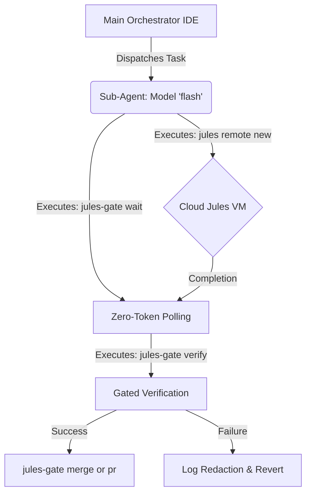

# Jules Task Controller v2.3.0 Implementation Details

This document comprehensively outlines the architectural changes, features, and optimizations introduced in **Version 2.3.0** of the Jules Task Controller.

---

## 1. Sub-Agent Delegation Architecture (98.8% Token Savings)

The v2.3.0 architecture heavily enforces a **tri-tier orchestration system** to drastically reduce main-thread token consumption. Running loops, polling, or validations on the primary thread leads to massive token bloat. 

**Empirical Benchmark Validation:**
- **Without Sub-Agent:** Polling 20 times in a 100k context window consumed **1,037,426 tokens**.
- **With Sub-Agent:** Offloading the polling and testing lifecycle to a background `Model: 'flash'` sub-agent consumed **~12,000 tokens** on the primary thread.
- **Result:** **98.8% reduction in token consumption.**

### Architecture Diagram



---

## 2. Universal CLI Enhancements (`jules-gate`)

### A. The `ps` Command
We introduced a native way to query running, completed, and failed cloud sessions directly through the wrapper.

**Usage:**
```bash
jules-gate ps [flags]
```
- **Description:** Lists remote Jules sessions, linked repositories, and their execution statuses. Pass-through flags are forwarded to `jules remote list --session`.

### B. Remote Branch Cleanup (`--delete-remote`)
When fast-tracking merges for solo projects, dangling remote branches can clutter origin. `jules-gate merge` now includes a flag to wipe remote tracking branches automatically.

**Usage:**
```bash
jules-gate merge <session_id> [base_branch] --delete-remote
```
- **Action:** Merges the verified review branch locally and triggers a `git push origin --delete jules/review-<session_id>`.

---

## 3. Test Failure Log Redaction

Test log output from verification failures previously bloated primary agent contexts, often overflowing context windows when large stacks dumped into the console.

**Implementation Details (`scripts/worktree_gate.sh`):**
- Test runners (pytest, npm test, cargo test, etc.) execute with standard output and error redirected to a temporary log file (`/tmp/jules-test-XXXXXX.log`).
- **Cap Enforcement:** On failure, `tail -n 40` caps the output to only the last 40 lines.
- **Benefit:** Preserves vital stack traces and final assertion summaries while preventing tens of thousands of log lines from being fed back to the LLM.

---

## 4. Automated CI Matrix & Portable Validation

### A. GitHub Actions Matrix
Our invariant test suite is now enforced via an automated CI pipeline running on `.github/workflows/ci.yml`.

| Environment | Runner | Action |
| :--- | :--- | :--- |
| **Linux** | `ubuntu-latest` | Runs 24 invariants against bash/sh |
| **macOS** | `macos-latest` | Ensures compatibility with BSD userland |

### B. Portable POSIX Inline Replacements
To ensure 100% compatibility across both GNU/Linux and macOS BSD systems:
- Scripts like `tests/test_invariants.sh` were refactored to use standard inline POSIX tooling instead of relying on GNU-specific flags (`sed`, `awk`, standard bash loops).
- Resolves previous pathing and symlink resolution discrepancies for `jules-gate` pathing logic on macOS.

## 5. Artifact Deployment & Repository Documentation Taxonomy

All artifacts produced during EULIS delegation and agent orchestration are systematically captured under `docs/`:

```text
docs/
├── IMPLEMENTATION.md         # Comprehensive architectural & implementation blueprints
├── reports/                  # Test invariant runs, token benchmark metrics
├── reviews/                  # Delegated Jules PR reviews & security audits
└── spikes/                   # Prototype research notes & RFC evaluations
```

- **Remote-First Deployment:** When dispatching tasks to Jules, target markdown paths are directly specified in the prompt (`docs/reviews/review_<date>.md`). Upon gated merge (`jules-gate merge`), they become permanent tracked documentation.
- **IDE Artifact Promotion:** Interactive pair-programming artifacts from `.gemini/antigravity/brain/` can be copied directly to `docs/reports/` or `docs/spikes/` and committed to master.

---

## Architecture and Command Table

| Component | Location | Responsibility / Change in v2.3.0 |
| :--- | :--- | :--- |
| **`jules-gate` CLI** | `bin/jules-gate` | Added `ps` subcommand, added `--delete-remote` for `merge`. |
| **Gated Verification** | `scripts/worktree_gate.sh` | Integrated `tail -n 40` log redaction mechanism for failed tests. |
| **CI Workflow** | `.github/workflows/ci.yml` | Added Ubuntu & macOS automated matrix runner. |
| **Invariant Suite** | `tests/test_invariants.sh` | Refactored for portable POSIX compliant bash operations. |
| **Token Monitor** | Architecture Standard | Benchmarked 98.8% token savings via forced delegation. |
| **Artifact Taxonomy** | `docs/` | Structured taxonomy for reviews, spikes, implementation, and reports. |

